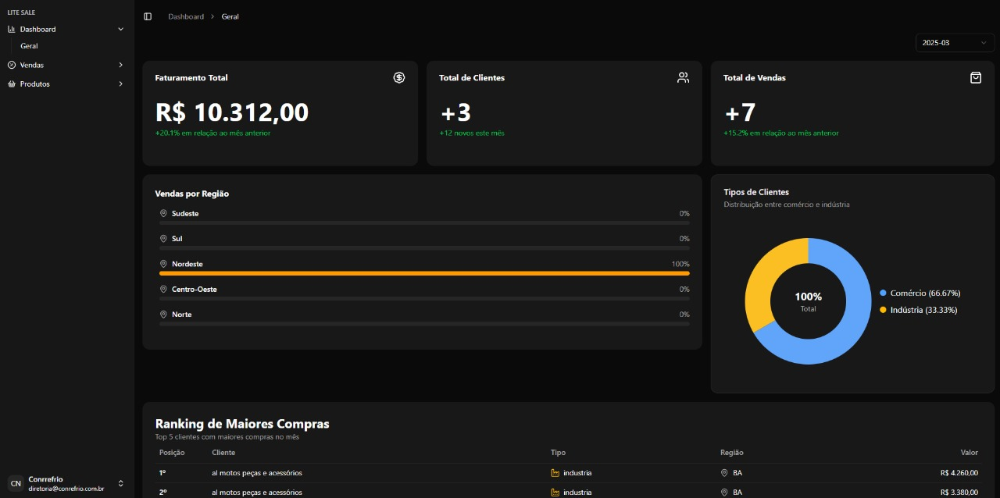
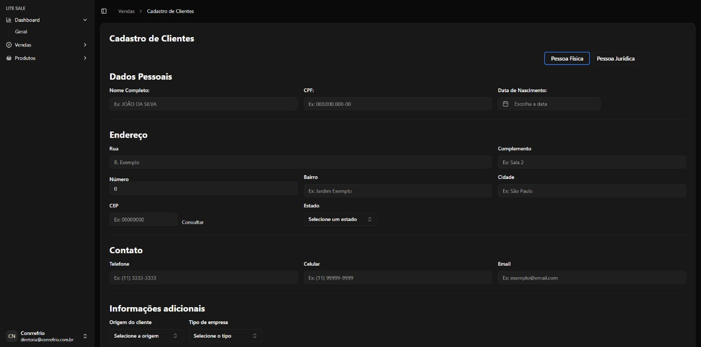
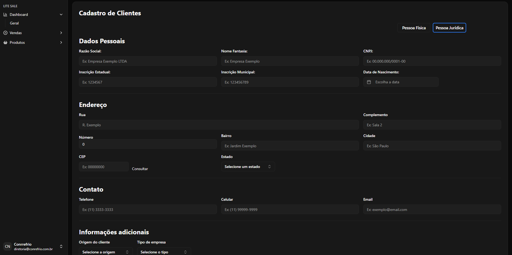

# CRM Conrrfrio ❄️

Sistema de CRM em desenvolvimento para a empresa **Conrrfrio**, voltado para facilitar o gerenciamento de clientes, histórico de atendimentos, e centralização das informações comerciais.

## ✨ Funcionalidades

- 📋 Cadastro e visualização de clientes
- 📊 Dashboard com visão geral dos dados
- 🔍 Busca e filtros personalizados

## 🧪 Tecnologias Utilizadas

- **React** – Interface moderna e reativa
- **ShadCN** – Componentes acessíveis e estilosos
- **Tailwind CSS** – Estilização rápida e responsiva
- **Supabase** – Banco de dados em tempo real e autenticação
- **Node.js** com **Fastify** – API leve e de alta performance (Parte de back-end está em outro repositorio)
- **Zod** – Validação de dados segura e elegante

## 📸 Imagens

### Dashboard em desenvolvimento:

### Tela de cadastro de cliente:

## 🚧 Status do Projeto

O sistema ainda está em fase de desenvolvimento, com melhorias e novas funcionalidades sendo implementadas continuamente.

---

Feito com 💙 para ajudar a Conrrfrio a evoluir sua gestão comercial.
